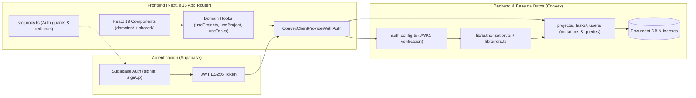
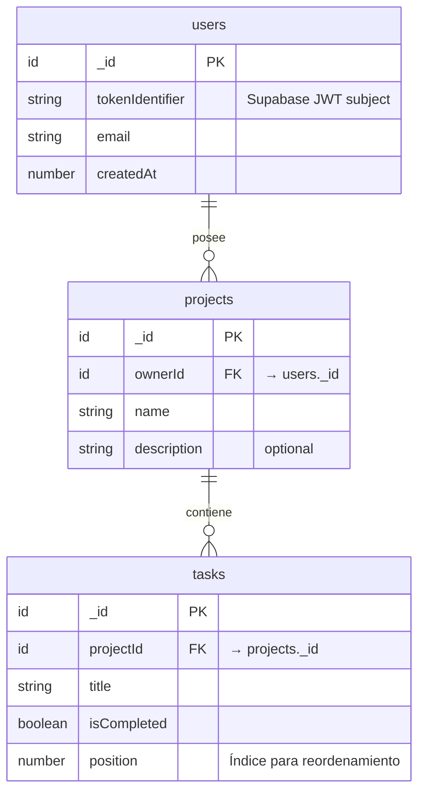
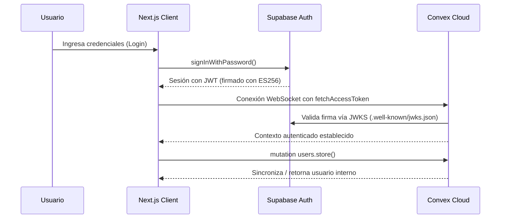

# Arquitectura del Sistema — Project Manager SaaS

## 1. Visión General

**Project Manager SaaS** es una plataforma de gestión de proyectos y tareas en tiempo real. La arquitectura sigue una filosofía de **"UI tonta, backend fuerte"**, donde toda la lógica de negocio, validaciones y autorización residen en **Convex**, mientras que el frontend construido en **Next.js 16** con **React 19** se enfoca exclusivamente en la experiencia de usuario, reactividad y rendimiento.

---

## 2. Diagrama de Arquitectura de Alto Nivel



---

## 3. Stack Tecnológico

| Capa | Tecnología | Versión | Propósito |
|---|---|---|---|
| **Framework Web** | Next.js (App Router) | 16.1.6 | SSR, Server Components, Routing |
| **Librería UI** | React | 19.2.3 | Renderizado declarativo y Hooks |
| **Lenguaje** | TypeScript | 5.x | Tipado estático end-to-end |
| **Estilos** | Tailwind CSS | 4.x | Utility-first CSS con `@theme` |
| **Componentes UI** | shadcn/ui + Radix UI + Lucide | -- | Componentes accesibles |
| **Backend & DB** | Convex | 1.31.3 | Base de datos reactiva, RPCs, live queries |
| **Autenticación** | Supabase Auth | 2.97.0 | Gestión de usuarios y emisión de JWTs ES256 |
| **Drag & Drop** | `@dnd-kit` | 6.3 / 10.0 | Reordenamiento interactivo de tareas |
| **Notificaciones** | Sonner | 2.0.7 | Toasts no intrusivos |
| **Visualización** | Recharts | 3.7.0 | Gráficas de progreso del proyecto |
| **Testing** | Vitest + RTL + Cypress | -- | Pruebas unitarias y E2E |

---

## 4. Estructura de Directorios

La aplicación organiza su frontend y backend por **Dominios de Negocio**:

```text
frontend/
├── convex/                          # Backend en la nube reactivo
│   ├── _generated/                  # Tipos autogenerados de Convex
│   ├── auth.config.ts               # Proveedor JWT Supabase (JWKS)
│   ├── schema.ts                    # Esquema de users, projects, tasks
│   ├── lib/
│   │   ├── authorization.ts         # requireAuthenticatedUser()
│   │   └── errors.ts                # DomainException y DomainErrorCode
│   ├── projects/
│   │   ├── mutations.ts             # create, remove, cleanupAll
│   │   └── queries.ts               # list, get
│   ├── tasks/
│   │   ├── mutations.ts             # create, update, remove, reorder
│   │   └── queries.ts               # (queries de tareas)
│   └── users/
│       ├── mutations.ts             # store
│       └── queries.ts               # me
├── domains/                         # Código modularizado por dominio de negocio
│   ├── projects/
│   │   ├── components/              # ProjectCard, CreateProjectModal, etc.
│   │   ├── hooks/                   # useProjects, useProject, useProjectMutations
│   │   └── types.ts                 # Project, ProjectWithTasks
│   ├── tasks/
│   │   ├── hooks/                   # useTaskMutations
│   │   └── types.ts                 # Task
│   └── dashboard/
│       └── components/              # StatsGrid
├── shared/                          # Recursos compartidos y agnósticos al dominio
│   ├── components/
│   │   ├── layout/                  # Header, Sidebar
│   │   └── ui/                      # button, card, dialog, input, etc. (shadcn)
│   ├── context/
│   │   └── AuthContext.tsx          # Sesión de usuario Supabase
│   └── lib/
│       ├── convex-provider.tsx      # ConvexProviderWithAuth bridge
│       ├── supabase.ts              # Cliente browser de Supabase
│       ├── userFacingError.ts       # Mapeo de errores de backend a mensajes amigables
│       └── utils.ts                 # cn() y helpers
└── src/
    ├── app/
    │   ├── (auth)/                  # Route group de autenticación
    │   │   ├── login/page.tsx
    │   │   └── register/page.tsx
    │   ├── (dashboard)/             # Route group protegido
    │   │   ├── page.tsx             # Dashboard principal
    │   │   └── projects/
    │   │       ├── page.tsx         # Listado de proyectos
    │   │       └── [id]/page.tsx    # Detalle de proyecto y tareas
    │   ├── layout.tsx               # Root layout con providers globales
    │   └── globals.css              # Variables de tema y tokens
    ├── proxy.ts                     # Network boundary Next.js 16 (middleware)
    └── __tests__/                   # Pruebas unitarias de UI
```

---

## 5. Modelo de Datos (Convex)



### Índices de Rendimiento
- **users:** `by_token(tokenIdentifier)`, `by_email(email)`
- **projects:** `by_owner(ownerId)`, `by_owner_and_name(ownerId, name)` (garantiza nombres únicos por usuario)
- **tasks:** `by_project(projectId)`

---

## 6. Flujo de Autenticación y Autorización



### Autorización Server-side
Toda operación sensible invoca `requireAuthenticatedUser(ctx)` en `convex/lib/authorization.ts`. En caso de sesión inválida o faltante, arroja un `DomainException` con código `DomainErrorCode.NOT_AUTHENTICATED`.

---

## 7. Middleware y Frontera de Red (`src/proxy.ts`)

En Next.js 16+, la convención recomendada de red es `proxy.ts`. Este archivo:
1. Inspecciona los cookies de sesión de Supabase SSR.
2. Refresca automáticamente el token si es necesario.
3. Redirige usuarios anónimos intentando acceder a rutas protegidas hacia `/login`.
4. Redirige usuarios ya autenticados que visiten `/login` o `/register` directamente al dashboard `/`.

---

## 8. Principios de Integración de IA y Validación con Zod (Zero-Trust Boundary)

Para futuras capacidades de IA generativa (Gemini, OpenAI, agentes autónomos), el sistema implementa una política de **Límite de Cero Confianza (Zero-Trust AI Boundary)**:

1. **Entrada No Confiable por Defecto:** Las salidas de modelos de lenguaje son probabilísticas y nunca deben insertarse de forma cruda en la base de datos de Convex ni mutar el estado de React sin validación previa.
2. **Intercepción y Sanitización:** Los payloads generados por LLMs son procesados con `safeParseAIResponse` (`frontend/shared/lib/ai/safe-ai-parser.ts`), eliminando bloques de markdown (` ```json `) y extrayendo el JSON estructurado.
3. **Validación Estricta con Zod:** Se aplican esquemas con descarte de campos extra (`.strip()`), coerciones seguras (`z.coerce.*`) y defaults defensivos.
4. **Flujo Convex Action -> Internal Mutation:**
   - La llamada a la API del proveedor de IA se realiza dentro de una **Convex Action**.
   - La acción valida el payload con Zod.
   - **Únicamente tras una validación exitosa**, se ejecuta la mutación interna (`internalMutation`) para persistir los datos.
5. **Resiliencia y Degradación Elegante:** En caso de discrepancia de esquema, se extraen los problemas (`formatZodIssuesForPrompt`) para reintento/autocorrección por el LLM o se activa un fallback seguro (`parseAIWithFallback`) impidiendo fallos de renderizado en la UI.

