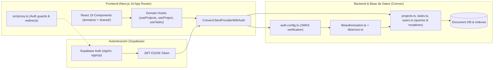
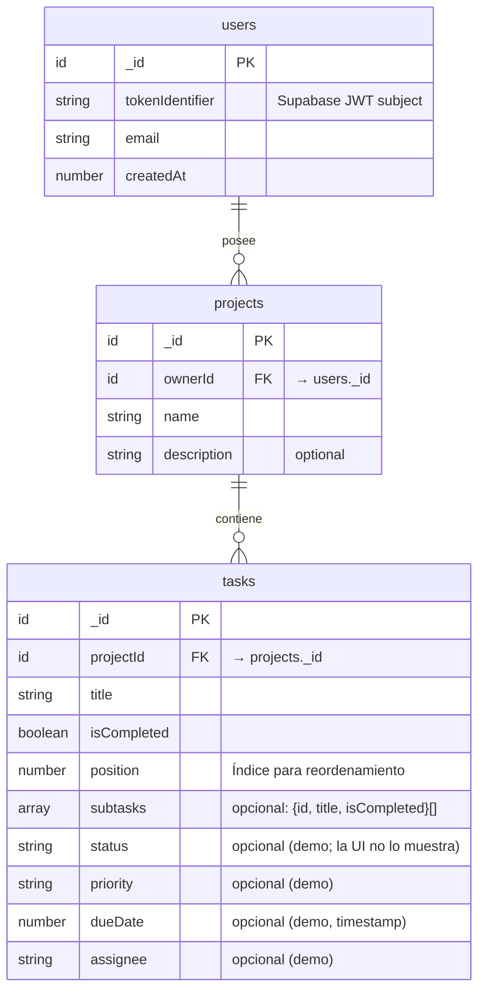
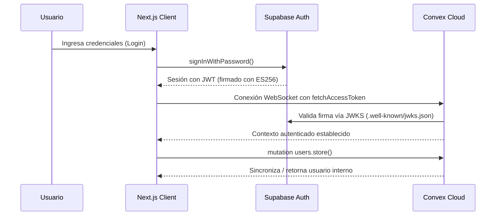
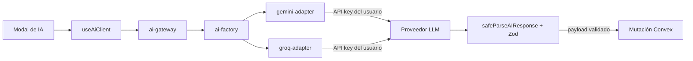
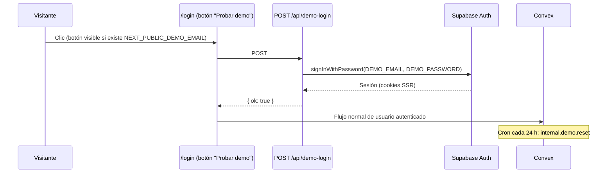

# Arquitectura del Sistema — Project Manager SaaS

## 1. Visión General

**Project Manager SaaS** es una plataforma de gestión de proyectos y tareas en tiempo real. La arquitectura sigue una filosofía de **"UI tonta, backend fuerte"**, donde toda la lógica de negocio, validaciones y autorización residen en **Convex**, mientras que el frontend construido en **Next.js 16** con **React 19** se enfoca exclusivamente en la experiencia de usuario, reactividad y rendimiento.

---

## 2. Diagrama de Arquitectura de Alto Nivel


```mermaid
graph LR
    subgraph Frontend["Frontend (Next.js 16 App Router)"]
        UI["React 19 Components (domains/ + shared/)"]
        Hooks["Domain Hooks (useProjects, useProject, useTasks)"]
        Proxy["src/proxy.ts (Auth guards & redirects)"]
        ConvexClient["ConvexClientProviderWithAuth"]
    end

    subgraph Auth["Autenticación (Supabase)"]
        SupaAuth["Supabase Auth (signIn, signUp)"]
        JWT["JWT ES256 Token"]
    end

    subgraph Backend["Backend & Base de Datos (Convex)"]
        AuthConf["auth.config.ts (JWKS verification)"]
        AuthLib["lib/authorization.ts + lib/errors.ts"]
        DomainFns["projects.ts, tasks.ts, users.ts (queries & mutations)"]
        DB[(Document DB & Indexes)]
    end

    Proxy -.-> SupaAuth
    UI --> Hooks
    Hooks --> ConvexClient
    ConvexClient --> DomainFns
    SupaAuth --> JWT
    JWT --> ConvexClient
    ConvexClient --> AuthConf
    AuthConf --> AuthLib
    AuthLib --> DomainFns
    DomainFns --> DB
```

---

## 3. Stack Tecnológico

| Capa | Tecnología | Versión | Propósito |
|---|---|---|---|
| **Framework Web** | Next.js (App Router) | 16.1.6 | SSR, Server Components, Routing |
| **Librería UI** | React | 19.2.3 | Renderizado declarativo y Hooks |
| **Lenguaje** | TypeScript | 5.x | Tipado estático end-to-end |
| **Estilos** | Tailwind CSS | 4.x | Utility-first CSS con `@theme` |
| **Componentes UI** | shadcn/ui + Radix UI + Lucide | -- | Componentes accesibles |
| **Backend & DB** | Convex | 1.31.3 | Base de datos reactiva, RPCs, live queries |
| **Autenticación** | Supabase Auth | 2.97.0 | Gestión de usuarios y emisión de JWTs ES256 |
| **Drag & Drop** | `@dnd-kit` | 6.3 / 10.0 | Reordenamiento interactivo de tareas |
| **Notificaciones** | Sonner | 2.0.7 | Toasts no intrusivos |
| **Visualización** | Recharts | 3.7.0 | Gráficas de progreso del proyecto |
| **Validación** | Zod | 4.x | Validación de respuestas de IA y formularios |
| **IA (BYOK)** | Gemini + Groq (cliente) | -- | Generación y refinamiento de proyectos |
| **Testing** | Vitest + RTL | 3.x | Pruebas unitarias y de componentes (Cypress fue retirado) |

---

## 4. Estructura de Directorios

La aplicación organiza su frontend y backend por **Dominios de Negocio**:

```text
frontend/
├── convex/                          # Backend en la nube reactivo
│   ├── _generated/                  # Tipos autogenerados de Convex
│   ├── auth.config.ts               # Proveedor JWT Supabase (JWKS)
│   ├── schema.ts                    # Esquema de users, projects, tasks (subtasks embebidas)
│   ├── lib/
│   │   ├── authorization.ts         # requireAuthenticatedUser(), requireProjectOwner()
│   │   ├── demoData.ts              # Datos sembrados de la demo
│   │   └── errors.ts                # DomainException y DomainErrorCode
│   ├── crons.ts                     # Reinicio diario de la demo
│   ├── demo.ts                      # reset (interna): restaura los datos del usuario demo
│   ├── projects.ts                  # list, get, create, createWithTasks, applyAiRefinement, remove, cleanupAll
│   ├── tasks.ts                     # create, update, remove, reorder, addSubtask, toggleSubtask,
│   │                                #   removeSubtask, convertTaskToSubtask
│   └── users.ts                     # me, store
├── domains/                         # Código modularizado por dominio de negocio
│   ├── projects/
│   │   ├── components/              # ProjectCard, CreateProjectModal, ProjectDetailClient, SortableTaskItem,
│   │   │                            #   ProjectProgressChart, GenerateProjectWithAiModal, RefineProjectWithAiModal
│   │   ├── hooks/                   # useProjects, useProject
│   │   ├── schemas/                 # ai-project.schema.ts, ai-refine.schema.ts (Zod)
│   │   └── types.ts                 # Project, ProjectWithTasks
│   ├── tasks/
│   │   ├── hooks/                   # useTaskMutations
│   │   └── types.ts                 # Task
│   └── dashboard/
│       └── components/              # StatsGrid
├── shared/                          # Recursos compartidos y agnósticos al dominio
│   ├── components/
│   │   ├── layout/                  # Header, Sidebar, DemoBanner
│   │   └── ui/                      # button, card, dialog, input, etc. (shadcn)
│   ├── context/
│   │   ├── AuthContext.tsx          # Sesión de usuario Supabase
│   │   └── ThemeContext.tsx         # Tema claro (default) / oscuro
│   └── lib/
│       ├── ai/                      # Gateway multi-proveedor (ver sección 8)
│       │   ├── adapters/            # gemini-adapter.ts, groq-adapter.ts
│       │   ├── ai-gateway.ts, ai-factory.ts, ai-storage.ts, ai-errors.ts
│       │   ├── config.ts            # Metadatos de modelos
│       │   ├── safe-ai-parser.ts    # Sanitización + validación Zod
│       │   └── useAiClient.ts       # Hook de acceso al cliente de IA
│       ├── convex-provider.tsx      # ConvexProviderWithAuth bridge
│       ├── supabase.ts              # Cliente browser de Supabase
│       ├── themeEngine.ts           # Motor de armonía de color dinámico
│       ├── userFacingError.ts       # Mapeo de errores de backend a mensajes amigables
│       └── utils.ts                 # cn() y helpers
└── src/
    ├── app/
    │   ├── api/demo-login/route.ts  # POST público: login del usuario demo (ver sección 9)
    │   ├── (auth)/                  # Route group de autenticación
    │   │   ├── login/page.tsx
    │   │   └── register/page.tsx
    │   ├── (dashboard)/             # Route group protegido
    │   │   ├── page.tsx             # Dashboard principal
    │   │   └── projects/
    │   │       ├── page.tsx         # Listado de proyectos
    │   │       └── [id]/page.tsx    # Detalle de proyecto y tareas
    │   ├── layout.tsx               # Root layout con providers globales
    │   └── globals.css              # Variables de tema y tokens
    ├── proxy.ts                     # Network boundary Next.js 16 (middleware)
    └── __tests__/                   # Pruebas unitarias y de componentes (Vitest)
```

---

## 5. Modelo de Datos (Convex)


```mermaid
erDiagram
    users {
        id _id PK
        string tokenIdentifier "Supabase JWT subject"
        string email
        number createdAt
    }
    projects {
        id _id PK
        id ownerId FK "→ users._id"
        string name
        string description "optional"
    }
    tasks {
        id _id PK
        id projectId FK "→ projects._id"
        string title
        boolean isCompleted
        number position "Índice para reordenamiento"
        array subtasks "opcional: {id, title, isCompleted}[]"
        string status "opcional (demo; la UI no lo muestra)"
        string priority "opcional (demo)"
        number dueDate "opcional (demo, timestamp)"
        string assignee "opcional (demo)"
    }

    users ||--o{ projects : "posee"
    projects ||--o{ tasks : "contiene"
```

### Índices de Rendimiento
- **users:** `by_token(tokenIdentifier)`, `by_email(email)`
- **projects:** `by_owner(ownerId)`, `by_owner_and_name(ownerId, name)` (garantiza nombres únicos por usuario)
- **tasks:** `by_project(projectId)`

---

## 6. Flujo de Autenticación y Autorización


```mermaid
sequenceDiagram
    participant User as Usuario
    participant Client as Next.js Client
    participant Supabase as Supabase Auth
    participant Convex as Convex Cloud

    User->>Client: Ingresa credenciales (Login)
    Client->>Supabase: signInWithPassword()
    Supabase-->>Client: Sesión con JWT (firmado con ES256)
    Client->>Convex: Conexión WebSocket con fetchAccessToken
    Convex->>Supabase: Valida firma vía JWKS (.well-known/jwks.json)
    Convex-->>Client: Contexto autenticado establecido
    Client->>Convex: mutation users.store()
    Convex-->>Client: Sincroniza / retorna usuario interno
```

### Autorización Server-side
Toda operación sensible invoca `requireAuthenticatedUser(ctx)` en `convex/lib/authorization.ts`. En caso de sesión inválida o faltante, arroja un `DomainException` con código `DomainErrorCode.NOT_AUTHENTICATED`.

**Aislamiento entre tenants:** autenticarse no basta. Toda mutación o query que reciba un `projectId` o `taskId` debe verificar que el proyecto pertenezca al usuario autenticado (`requireProjectOwner` en `convex/lib/authorization.ts`, usado por `convex/tasks.ts` y `convex/projects.ts`) y que las tareas pertenezcan a ese proyecto. `tasks.reorder` carecía de esta comprobación (IDOR entre tenants) y se corrigió en `990d109`; toda función nueva debe seguir el mismo patrón.

---

## 7. Middleware y Frontera de Red (`src/proxy.ts`)

En Next.js 16+, la convención recomendada de red es `proxy.ts`. Este archivo:
1. Inspecciona los cookies de sesión de Supabase SSR.
2. Refresca automáticamente el token si es necesario.
3. Redirige usuarios anónimos intentando acceder a rutas protegidas hacia `/login`.
4. Redirige usuarios ya autenticados que visiten `/login` o `/register` directamente al dashboard `/`.
5. Deja pasar `/api/demo-login` sin comprobar sesión: esa ruta gestiona la suya (sección 9).

---

## 8. Principios de Integración de IA y Validación con Zod (Zero-Trust Boundary)

### 8.1 Arquitectura: BYOK en el cliente

Las llamadas a IA se hacen **desde el navegador** con la API key del propio usuario (BYOK, *Bring Your Own Key*). La key se guarda solo en `localStorage` (`frontend/shared/lib/ai/ai-storage.ts`) y **no pasa por el backend de Convex**. Convex solo recibe el resultado ya validado, a través de mutaciones normales.


```mermaid
graph LR
    UI[Modal de IA] --> Hook[useAiClient]
    Hook --> GW[ai-gateway]
    GW --> F[ai-factory]
    F --> G[gemini-adapter]
    F --> Q[groq-adapter]
    G & Q -->|API key del usuario| LLM[Proveedor LLM]
    LLM --> P[safeParseAIResponse + Zod]
    P -->|payload validado| M[Mutación Convex]
```

Módulos en `frontend/shared/lib/ai/`:

| Archivo | Responsabilidad |
| :--- | :--- |
| `ai-gateway.ts` / `ai-factory.ts` | Gateway multi-proveedor; resuelve proveedor y key y entrega el adaptador. |
| `adapters/gemini-adapter.ts` | Adaptador Gemini con modelos de fallback (`GEMINI_FALLBACK_MODELS`). |
| `adapters/groq-adapter.ts` | Adaptador Groq. |
| `ai-storage.ts` | Proveedor y API keys en `localStorage`. Proveedor por defecto: `gemini`. |
| `config.ts` | Metadatos de los modelos disponibles. |
| `ai-errors.ts` | Errores tipados de IA y mapeo a mensajes para el usuario (ADR 003). |
| `safe-ai-parser.ts` | Sanitización y validación Zod de respuestas del LLM. |
| `useAiClient.ts` | Hook de acceso al cliente de IA (proveedor, key, `generateStructured`). |

### 8.2 Funcionalidades

| Funcionalidad | Componente | Esquema Zod | Persistencia |
| :--- | :--- | :--- | :--- |
| Generar proyecto | `GenerateProjectWithAiModal` | `domains/projects/schemas/ai-project.schema.ts` | `projects.createWithTasks` |
| Refinar proyecto (copiloto) | `RefineProjectWithAiModal` | `domains/projects/schemas/ai-refine.schema.ts` | `projects.applyAiRefinement` |

### 8.3 Política de Cero Confianza (Zero-Trust AI Boundary)

1. **Entrada no confiable por defecto:** las salidas de modelos de lenguaje son probabilísticas y nunca se insertan crudas en Convex ni mutan el estado de React sin validación previa.
2. **Sanitización:** `safeParseAIResponse` (`shared/lib/ai/safe-ai-parser.ts`) elimina bloques markdown (` ```json `) y extrae el JSON.
3. **Validación estricta con Zod:** los esquemas descartan campos desconocidos (comportamiento por defecto de `z.object`, equivalente a `.strip()`), usan coerciones seguras (`z.coerce.*`) y defaults defensivos.
4. **Mutación solo con payload validado:** el cliente llama a la mutación de Convex únicamente tras una validación exitosa. La mutación **vuelve a exigir autenticación y propiedad del proyecto** (`requireAuthenticatedUser` / `requireProjectOwner`, sección 6): el cliente no es de confianza.
5. **Resiliencia y degradación elegante:** ante discrepancias de esquema, `formatZodIssuesForPrompt` extrae los problemas para reintento o autocorrección por el LLM, y `parseAIWithFallback` entrega un fallback seguro que evita fallos de renderizado. Los errores de proveedor se tipifican en `ai-errors.ts`.

Decisiones relacionadas: [ADR 002](docs/adr/002-ai-response-validation-with-zod.md) (validación con Zod) y [ADR 003](docs/adr/003-typed-ai-error-handling-and-resilience.md) (errores tipados y resiliencia).

---

## 9. Demo de un clic

Permite probar la app con datos de ejemplo sin registrarse.


```mermaid
sequenceDiagram
    participant U as Visitante
    participant L as /login (botón "Probar demo")
    participant R as POST /api/demo-login
    participant S as Supabase Auth
    participant C as Convex

    U->>L: Clic (botón visible si existe NEXT_PUBLIC_DEMO_EMAIL)
    L->>R: POST
    R->>S: signInWithPassword(DEMO_EMAIL, DEMO_PASSWORD)
    S-->>R: Sesión (cookies SSR)
    R-->>L: { ok: true }
    L->>C: Flujo normal de usuario autenticado
    Note over C: Cron cada 24 h: internal.demo.reset
```

- **Credenciales:** `DEMO_EMAIL` y `DEMO_PASSWORD` existen solo en el servidor (sin prefijo `NEXT_PUBLIC`). Si faltan, la ruta responde 404.
- **Límite de intentos:** 10 por minuto por IP, en memoria de la instancia (best-effort, no global).
- **Reinicio:** `convex/crons.ts` ejecuta cada 24 h `internal.demo.reset` (`convex/demo.ts`), que borra los proyectos y tareas del usuario demo (lo crea si no existe) y los vuelve a sembrar desde `convex/lib/demoData.ts`. Solo toca al usuario cuyo `tokenIdentifier` es `DEMO_TOKEN_IDENTIFIER`; si la variable falta, no hace nada. `reset` es interna, no se puede llamar desde el cliente.
- **UI:** `DemoBanner` (en el header) se muestra solo cuando el email de la sesión coincide con `NEXT_PUBLIC_DEMO_EMAIL` y avisa de que los datos se reinician.
- **Variables:** Next/Vercel: `NEXT_PUBLIC_DEMO_EMAIL`, `DEMO_EMAIL`, `DEMO_PASSWORD`. Convex: `DEMO_TOKEN_IDENTIFIER`, `DEMO_EMAIL`.
- **Pruebas:** `convex/demo.test.ts`.

